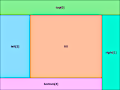
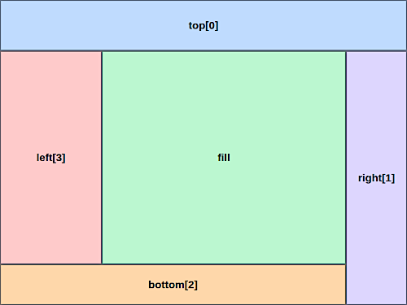

# react-mui-dockpanel

外郭スタッキングを提供する、React MUI 向け DockPanel コンポーネントライブラリです。



[](https://www.repostatus.org/#active)
[](https://opensource.org/licenses/MIT)
[](https://www.npmjs.com/package/react-mui-dockpanel)

---

[(English language is here)](./README.md)

## これは何？

ウェブサイトのデザインで、ページサイズに大まかに連動してサイズが変更されつつ、各コンポーネントの論理的な配置を維持したいと考えたことはありますか？
このような配置はCSS flexを使用することで実現しますが、コンポーネントの配置と管理は煩雑になりがちです。
特に、管理系のページレイアウトによく見られ、いわゆる「エクスプローラー」的なペーンレイアウトを採用したい場合に適用されます。

`DockPanel` は、React MUIのレイアウトコンポーネントで、このようなページレイアウトを簡単に実現します。

JSX の順序に従って外郭の辺のペイン `Dock` に子コンポーネントを配置します。
各 `Dock` はその時点で残っている矩形から領域を取り、最後の `fill` が残りの領域を受け取ります。

以下のようなTypescript JSXによって（スタイルの指定は省略）:

```tsx
import { Dock, DockPanel } from "react-mui-dockpanel";

export const Workspace = () => (
  <DockPanel>
    <Dock dock="top">top[0]</Dock>
    <Dock dock="right">right[1]</Dock>
    <Dock dock="bottom">bottom[2]</Dock>
    <Dock dock="left">left[3]</Dock>
    <Dock>fill</Dock>
  </DockPanel>
);
```

`Dock` 内のコンポーネントがこのように配置されます:



各コンポーネントが、外郭の最外周から順に「辺」を消化して中央に近づきます。残った領域が `fill` の部分を占めます。
各 `Dock` の領域は、外郭のサイズ変更に自然に追従するため、おおまかにどの「辺」にコンポーネントを配置するのかを考えるだけでよく、
レスポンシブデザインレイアウトを実現できます。特に、ページ全体を使う管理系のページデザインで重宝します。

> Windows Formsのレイアウト規則を知っていれば、すぐに馴染めるでしょう。

### 特徴

- React MUIの軽量レイアウトコンポーネントとして使用可能
- 複雑なCSS flex指定を回避して、論理的なコンポーネントレイアウトを実現

---

## インストール

```bash
npm install react-mui-dockpanel
```

React、React MUIも参照される必要があります（`peerDependencies` として示されています。手動でパッケージをインストールしてください）。

## 基本的な使い方

```tsx
import { Box } from "@mui/material";
import { Dock, DockPanel } from "react-mui-dockpanel";

export const Workspace = () => (
  <DockPanel sx={{ width: 800, height: 600 }}>
    <Dock dock="top" size={48}>
      <Box sx={{ height: "100%" }}>Toolbar</Box>
    </Dock>
    <Dock dock="left" size={240}>
      <Box sx={{ height: "100%" }}>Navigation</Box>
    </Dock>
    <Dock dock="top" size="auto">
      <Box sx={{ height: 32 }}>Document tabs</Box>
    </Dock>
    <Dock>
      <Box sx={{ height: "100%" }}>Content</Box>
    </Dock>
  </DockPanel>
);
```

`dock` のデフォルトは `"fill"` です。そのため、上記の最後の `Dock` は `<Dock dock="fill">` と同じ意味になります。

## スタッキング順序

Dock の配置は順序に依存します。次の例では:

```tsx
<DockPanel sx={{ width: 800, height: 600 }}>
  <Dock dock="top" size={100} />
  <Dock dock="left" size={200} />
  <Dock dock="top" size={50} />
  <Dock />
</DockPanel>
```

以下の矩形が生成されます:

| ペイン    | 矩形                                  |
| --------- | ------------------------------------- |
| outer top | `x=0, y=0, width=800, height=100`     |
| left      | `x=0, y=100, width=200, height=500`   |
| inner top | `x=200, y=100, width=600, height=50`  |
| fill      | `x=200, y=150, width=600, height=450` |

同じ方向は複数回指定できます。各 item は、その時点で残っている矩形を消費します。

## サイズ

`size` には数値と CSS 文字列を指定できます。

```tsx
<Dock dock="left" size={240} />
<Dock dock="right" size="25%" />
<Dock dock="top" size="auto" />
```

数値はピクセルとして扱われます。`"auto"` はデフォルトで、ペイン内容の自然サイズを使用します。
`left` と `right` で自然サイズを使う場合、子コンポーネント側に安定した幅を持たせる必要があります。

`dock="fill"` では `size` は無視されます。

## Fill のルール

`DockPanel` は 0 個または 1 個の fill ペインをサポートします。

```tsx
<DockPanel>
  <Dock dock="top" size={48} />
  <Dock />
</DockPanel>
```

外郭ペインは fill ペインより前に配置する必要があります。fill ペインが指定されない場合、残りの矩形は空のまま残されます。

---

## 制約

MUI `AppBar` や `Drawer` のように、ページレベルのレイアウトを構成する特殊なコンポーネントの場合は、`DockPanel` の外側に配置してください。

```tsx
import { AppBar, Box, Toolbar } from "@mui/material";
import { Dock, DockPanel } from "react-mui-dockpanel";

export const Shell = () => (
  <Box sx={{ display: "flex", flexDirection: "column", height: "100vh" }}>
    <AppBar position="static">
      <Toolbar />
    </AppBar>
    <DockPanel sx={{ flex: "1 1 auto", minHeight: 0 }}>
      <Dock dock="left" size={240} />
      <Dock />
    </DockPanel>
  </Box>
);
```

`AppBar` を Dock された top ペインの内側に配置する場合は、flex レイアウトに参加できるように `position="static"` を推奨します。
MUI `Drawer` もペイン内に配置できますが、アプリケーション側で DockPanel 領域内に収まる variant とサイズ指定を選ぶ必要があります。

---

## 開発

```bash
npm install
npm run build
npm test
```

- `npm test` は Vitest の単体テストと Playwright のブラウザレイアウトテストの両方を実行します。
- Playwright のスクリーンショットは `test-results/YYYYMMDD_HHmmss_fff/{test-name}/screenshot.png` に保存されます。
- Playwright 内部の `outputDir` は `.playwright-output` なので、e2e 実行時に `test-results` に保存済みのスクリーンショットは削除されません。
- e2e アプリは `DockPanel` に具体的なピクセルサイズを設定しません。ページ全体を埋め、Playwright で設定された viewport が測定されるレイアウトとスクリーンショットサイズを決定します。

## ライセンス

Under MIT.
